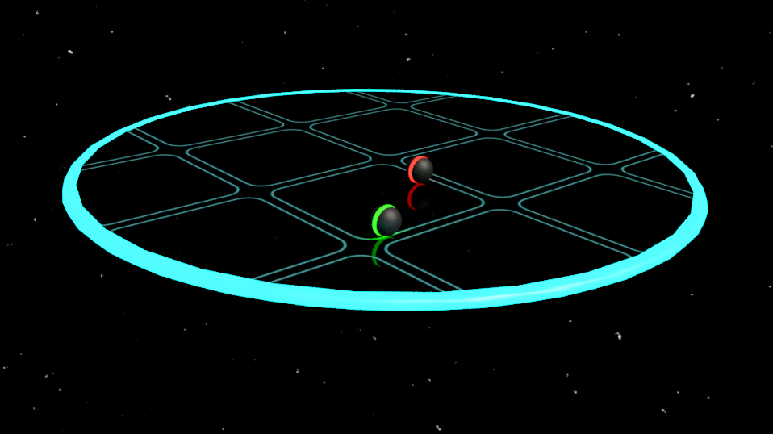

A Gyroscope/Accelerometer mobile Unity game

Galaxy Gladiators[PlaceHolder Title]


## Getting Started

lol we have nothing

### Prerequisites

```
xd
```

### Installing

* Clone the repository
* Open in Unity

```

```
## Built With

* [Unity](https://unity3d.com/) - The game engine used
* [Blender](https://www.blender.org/) - The 3D modelling software used

## Authors
**Team Fishball**
* **Clement Leow Seng Woon** - *Initial work* - [ClementLSW](https://github.com/ClementLSW)
* **Phee Kian Ann** - *Initial work* - [Ki-ann](https://github.com/Ki-ann)

## License

This project is licensed under the MIT License - see the [LICENSE.md](LICENSE.md) file for details

## Acknowledgments

* Hat tip to anyone who's code was used
* Inspiration
* etc
